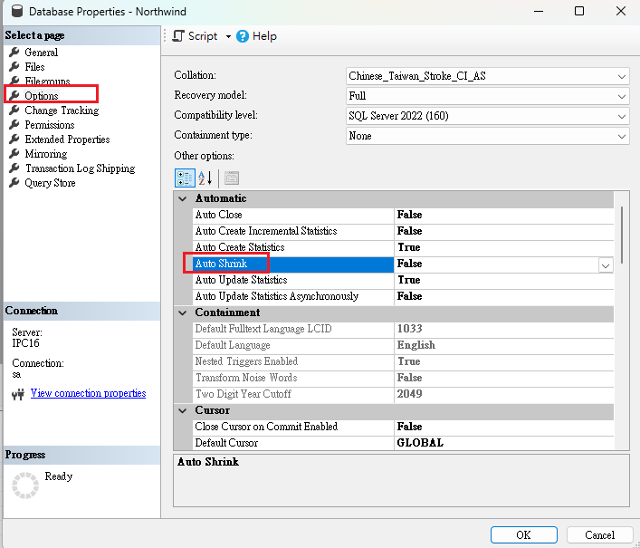
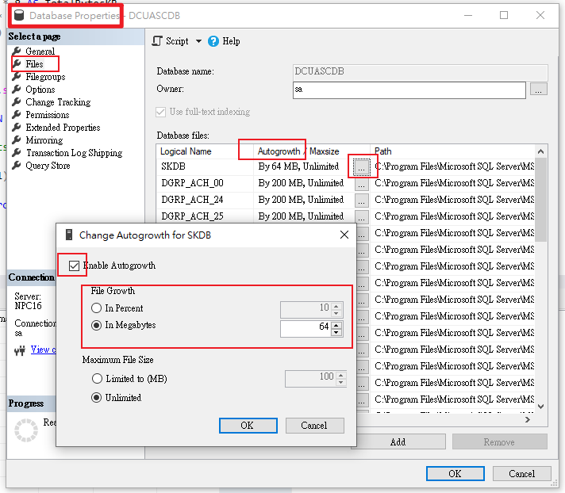
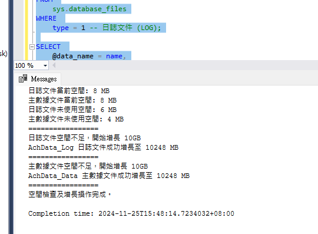
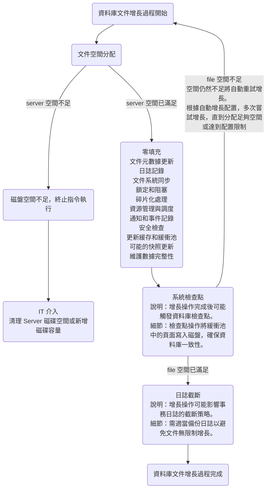

### Performance Issue

### Table Column Setting

#### Column store Index 資料行存放區索引

「資料行存放區索引」是儲存和查詢大型資料倉儲事實資料表的標準。 此索引使用以資料行為基礎的資料儲存和查詢處理，相較於傳統的資料列導向儲存，最高可在您的資料倉儲中達到 10 倍的查詢效能改善。 相較於未壓縮的資料大小，您也可以將資料壓縮提升高達 10 倍。 從 SQL Server 2016 (13.x) SP1 開始，資料行存放區索引可啟用作業分析：在交易式工作負載上執行高效能即時分析的能力。

### Database Properties Setting

#### Auto Shrink

Database Properties

Auto Shrink 的作用是釋放未使用的磁碟空間，而不是壓縮或刪除資料。但由於它對性能和碎片化的潛在影響，建議在大多數情況下不要啟用。如果需要清理磁碟空間，可以使用手動的方式來更有效地管理。



#### Autogrowth 自動增長設置

Database Properties

設計用來在資料檔案（Data File）或日誌檔案（Log File）空間不足時，自動擴展檔案大小，以保障交易和數據寫入的正常進行。

在處理高交易量與高併發的環境中，自動增長占用的效能可能成為效能瓶頸之一。

尤其當增長頻繁或配置不佳時，可能導致系統資源緊張或操作延遲。

適當規劃初始檔案大小與增長策略，不僅能避免增長對效能的負面影響，還能為穩定數據處理提供堅實基礎。



table 的資料，一頁一頁存在資料庫裡，每頁固定 8KB ，

SQL Server 檢查文件中是否有足夠的頁（8 KB 每頁）來滿足當前數據插入或更新操作的需要。

##### Check Unused spaces

Check File Unused spaces

```sql
SELECT 
   (size - FILEPROPERTY(name, 'SpaceUsed')) * 8 / 1024 SpaceUnused,
   size,
   FILEPROPERTY(name, 'SpaceUsed') SpaceUsed, 
   *
FROM 
    sys.database_files
```

Check Table pages Unused spaces

```sql
SELECT 
    t.name AS TableName,
    s.name AS SchemaName,
    p.rows AS RowCounts,
    SUM(a.total_pages) * 8 AS TotalBytesKB,
    SUM(a.used_pages) * 8 AS UsedBytesKB,
    (SUM(a.total_pages) - SUM(a.used_pages)) * 8 AS UnusedBytesKB,
	SUM(a.total_pages) - SUM(a.used_pages) AS UnusedPages
FROM 
    sys.tables t
INNER JOIN 
    sys.schemas s ON t.schema_id = s.schema_id
INNER JOIN 
    sys.partitions p ON t.object_id = p.object_id
INNER JOIN 
    sys.allocation_units a ON p.partition_id = a.container_id
WHERE 
    p.index_id IN (0, 1) -- 0: Heap, 1: Clustered index
GROUP BY 
    t.name, s.name, p.rows
ORDER BY 
    TotalBytesKB DESC;
```

UnusedBytesKB 可以看到每個 table 剩餘的使用空間

當一次交易產生的的資料量新增，高於剩餘的使用空間

就會觸發自動增長(Autogrowth ) 每次增長 64 MB (依照 Database Properties 設置)

此時會循環檢查資料量新增是否足夠，如果還是不夠，會再次觸發自動增長，直到增長足夠

##### Autogrowth Setting strategy

| 項目           | **自動增長設置太大**                                         | **自動增長設置太小**                                         |
| -------------- | ------------------------------------------------------------ | ------------------------------------------------------------ |
| **缺點**       | - 單次增長花費時間更長，期間暫停影響 Server 更大。<br />- 大量增長硬碟空間浪費，可能導致磁碟利用率過低。<br />- 若配置不當，可能迅速耗盡剩餘磁碟空間，危及系統穩定性。 | - 增長次數多，頻繁增長會影響其他 DML 操作效能。<br />- 容易導致資料碎片化，對長期效能有負面影響。<br />- 頻繁檢查和管理磁碟空間，增加系統開銷。 |
| **優點**       | - 減少增長操作的頻率，降低頻繁增長帶來的資源開銷。<br />- 提升系統短期內的效能穩定性，避免頻繁增長中斷操作。 | - 更靈活地根據需求調整資源配置，避免硬碟空間長期浪費。<br />- 單次增長操作耗時短，對事務和其他操作影響小。 |
| **交易風險**   | - 單次增長可能中斷長時間運行的事務，導致事務執行效率降低或失敗。 | - 頻繁增長可能多次中斷事務，對事務穩定性和效能有更大影響。   |
| **空間利用率** | - 配置大小不應超過磁碟剩餘空間的 20-30%，以避免單次增長耗盡磁碟資源。<br />- 增長過大會導致磁碟資源分配過度保守。 | - 配置建議應大於單次常見增長需求 20-30%，以確保每次增長能有效應對實際需求。<br />- 可避免因增長過小造成的頻繁操作和效能問題。 |

1. 整體交易的資料量大小

2. Bulk Insert 單筆的資料量大小

   單筆交易進行資料寫入時，如 Bulk Insert 資料量太大，會連續觸發增長，延長 locking 時間，阻塞其他新刪修的執行。

   新刪修依賴 Log 資料的讀寫，Log Locking 會影響新刪修，select 屬於 page 層級，故不受 auto growth blocking 影響。

3. 監控觀察增長速度、次數

##### Autogrowth In Percent

百分比增長，在文件很大時可能導致不必要的增長過多。

##### Autogrowth In Mb

In Mb 64 相當於 65535KB，意即每次擴增資料庫頁數一次65535/8 = 8192頁

如若當次對資料庫新增或修改的資料量頁數不足，則會一次擴增 8192 頁

##### Autogrowth Manual 手動 Growth `提醒 FILE SIZE 只能往更大容量修改，縮小參照 DBCC SHRINKFILE` 

預測到特定分區會頻繁增長，提前手動調整其文件組的大小，以減少 AutoGrowth 的觸發。

1. 手動增加 File Data

```sql
ALTER DATABASE AchData
MODIFY FILE (
    NAME = AchData_Data,
    SIZE = 20GB
);
```

2. 手動增加 log Data

```sql
ALTER DATABASE AchData
  MODIFY FILE(
    NAME = AchData_Log,
    SIZE = 20GB
  );
```

##### Autogrowth By Agent 排程 Growth `提醒 FILE SIZE 只能往更大容量修改，縮小參照 DBCC SHRINKFILE` 

Server Agent、或排程啟動，避開 Sql 高峰期

```sql
--可定義參數
DECLARE @db_name NVARCHAR(128) = 'AchData'; -- 數據庫名稱
DECLARE @log_name NVARCHAR(128) = 'AchData.Log'; -- 日誌文件邏輯名稱
DECLARE @data_name NVARCHAR(128) ='AchData.Data'; -- 主數據文件邏輯名稱
DECLARE @log_check INT = 10; -- 日誌文件空間閾值 (GB)
DECLARE @data_check INT = 10; -- 主數據文件空間閾值 (GB)
DECLARE @growth_gb INT = 10; -- 增長大小 (GB)

---------------------------------------------------------
DECLARE @log_free_space_mb INT;
DECLARE @data_free_space_mb INT;
DECLARE @log_current_size_mb INT; -- 日誌文件當前大小 (MB)
DECLARE @data_current_size_mb INT; -- 主數據文件當前大小 (MB)
DECLARE @log_new_size_mb INT; -- 日誌文件新大小 (MB)
DECLARE @data_new_size_mb INT; -- 主數據文件新大小 (MB)

DECLARE @sql NVARCHAR(MAX); -- 用於存儲動態 SQL

-- 獲取文件邏輯名稱及當前大小
SELECT 
    @log_name = name,
    @log_current_size_mb = size * 8 / 1024 -- 將當前大小從頁轉換為 MB
FROM 
    sys.database_files
WHERE 
    type = 1 -- 日誌文件 (LOG);

SELECT 
    @data_name = name,
    @data_current_size_mb = size * 8 / 1024 -- 將當前大小從頁轉換為 MB
FROM 
    sys.database_files
WHERE 
    type = 0 -- 主數據文件 (DATA);

-- 檢查日誌文件未使用空間
SELECT 
    @log_free_space_mb = (size - FILEPROPERTY(name, 'SpaceUsed')) * 8 / 1024
FROM 
    sys.database_files
WHERE 
    type = 1 -- 日誌文件 (LOG);

-- 檢查主數據文件未使用空間
SELECT 
    @data_free_space_mb = (size - FILEPROPERTY(name, 'SpaceUsed')) * 8 / 1024
FROM 
    sys.database_files
WHERE 
    type = 0 -- 主數據文件 (DATA);

-- 輸出檢查結果
PRINT '日誌文件當前空間: ' + CAST(@log_current_size_mb AS NVARCHAR) + ' MB';
PRINT '主數據文件當前空間: ' + CAST(@data_current_size_mb AS NVARCHAR) + ' MB';
PRINT '日誌文件未使用空間: ' + CAST(@log_free_space_mb AS NVARCHAR) + ' MB';
PRINT '主數據文件未使用空間: ' + CAST(@data_free_space_mb AS NVARCHAR) + ' MB';
PRINT '=================';
-- 日誌文件空間檢查
IF @log_free_space_mb < (@log_check * 1024) -- 閾值轉換為 MB
BEGIN
    PRINT '日誌文件空間不足，開始增長 10GB';

    -- 計算新的大小
    SET @log_new_size_mb = @log_current_size_mb + (@growth_gb * 1024);

    -- 構建動態 SQL 並執行
    SET @sql = N'ALTER DATABASE [' + @db_name + N']
        MODIFY FILE (
            NAME = ''' + @log_name + N''',
            SIZE = ' + CAST(@log_new_size_mb AS NVARCHAR) + N'MB
        );';

    EXEC sp_executesql @sql;
    PRINT @log_name + ' 日誌文件成功增長至 ' + CAST(@log_new_size_mb AS NVARCHAR) + ' MB';
END
ELSE
BEGIN
    PRINT '日誌文件空間充足，可用空間'+CAST(@log_free_space_mb AS NVARCHAR)+'，無需增長';
END;
	PRINT '=================';

-- 主數據文件空間檢查
IF @data_free_space_mb < (@data_check * 1024) -- 閾值轉換為 MB
BEGIN
    PRINT '主數據文件空間不足，開始增長 10GB';

    -- 計算新的大小
    SET @data_new_size_mb = @data_current_size_mb + (@growth_gb * 1024);

    -- 構建動態 SQL 並執行
    SET @sql = N'ALTER DATABASE [' + @db_name + N']
        MODIFY FILE (
            NAME = ''' + @data_name + N''',
            SIZE = ' + CAST(@data_new_size_mb AS NVARCHAR) + N'MB
        );';

    EXEC sp_executesql @sql;
    PRINT @data_name + ' 主數據文件成功增長至 ' + CAST(@data_new_size_mb AS NVARCHAR) + ' MB';
END
ELSE
BEGIN
    PRINT '主數據文件空間充足，可用空間'+CAST(@data_free_space_mb AS NVARCHAR)+'，無需增長';
END;
	PRINT '=================';

PRINT '空間檢查及增長操作完成。';
```

> SIZE =  語法支援  [ , SIZE = size [ KB | MB | GB | TB ] ] 寫法，但可能因為 SQL 版本的不同而只支援KB、MB

檢查前


檢查後增長



再次檢查空間


#### Autogrowth 分析監控選擇設置策略

##### 新增監控

#### Autogrowth 觸發流程

##### Autogrowth 觸發流程 簡圖

自動增長會根據設置（固定大小或百分比）分配磁盤空間，若分配失敗（如磁盤空間不足），操作將記錄錯誤並終止。增長過程形成迴圈，當操作重試時，會回到文件增長起點，直到空間分配成功或達到配置限制。過多的自動增長次數可能造成性能影響，包括文件鎖定、I/O 延遲及碎片化，特別是增長頻繁且每次增量過小時，對效能影響更顯著。




1. 文件空間分配

   說明：資料庫引擎需要在磁盤上分配新的空間，以擴展數據文件或日誌文件的大小。

   細節：涉及操作系統層面的磁盤空間分配，並根據自動增長設置分配適當的空間（MB 或百分比）。如果磁盤空間不足，將記錄錯誤並終止操作。")

2. 零填充

   說明：SQL Server 將新分配的空間初始化為零（僅適用於數據文件）。

   細節：確保新空間不包含舊數據，零填充操作避免安全問題。日誌文件不執行零填充，僅記錄新的 VLF（Virtual Log File）。")

3. 文件元數據更新

   說明：資料庫需要更新其內部元數據，以反映文件大小的變化。

   細節：包括更新系統表（如 `sys.master_files`），文件頭信息也會記錄新大小和增長參數。")

4. 日誌記錄

   說明：增長操作會記錄到事務日誌中，以保證操作的可恢復性。

   細節：在崩潰或故障情況下，可通過日誌進行回滾或重試增長操作。")

5. 文件系統同步

   說明：完成文件增長後，文件系統需要正確識別和管理新文件大小。

   細節：可能需要刷新文件系統緩存，以同步實際文件大小和元數據。")

6. 鎖定和阻塞

   說明：增長過程可能會對文件進行獨佔鎖定，防止其他操作干擾。

   細節：可能導致對該文件進行 I/O 操作的事務被阻塞，直到增長完成。")

7. 碎片化處理

   說明：如果磁盤上沒有足夠連續空間，文件可能分割成碎片。

   細節：碎片化會影響讀寫性能，資料庫引擎可能需要額外的資源進行處理。

8. 資源管理與調度

   說明：增長操作需要消耗 CPU 和 I/O 資源，資料庫需要管理資源分配。

   細節：SQL Server 可能調整增長操作優先級，避免影響關鍵操作。

9. 通知和事件記錄

   說明：增長事件會記錄到 SQL Server 日誌或 Windows 事件查看器中。

   細節：幫助管理員監控資料庫狀態，必要時採取行動。

10. 安全檢查

    說明：確保執行增長操作的用戶具有適當權限。

    細節：資料庫會檢查執行操作的用戶是否有權修改文件大小。

11. 更新緩存和緩衝池

    說明：文件增長後，緩衝池需要更新以反映新空間。

    細節：確保讀寫操作正確訪問新分配的空間。

12. 可能的快照更新

    說明：如果使用資料庫快照，增長操作需要更新快照信息。

    細節：確保快照與主資料庫保持同步，避免數據不一致。

13. 維護數據完整性

    說明：確保增長操作不會損壞現有數據結構和索引。

    細節：資料庫執行結構檢查，確保數據完整性。

14. 系統檢查點

    說明：增長操作完成後可能觸發資料庫檢查點。

    細節：檢查點操作將緩衝池中的頁面寫入磁盤，確保資料庫一致性。

15. 日誌截斷 
    說明：增長操作可能影響事務日誌的截斷策略。
    細節：需適當備份日誌以避免文件無限制增長。
    
## Mssql AutoGrowth

1. 新增監控

   ```sql
   CREATE EVENT SESSION MonitorAchData_Log 
   ON SERVER 
   ADD EVENT sqlserver.database_file_size_change(
   	ACTION ( sqlserver.sql_text )
       WHERE is_automatic = 1 
   	and file_name = 'AchData_Log'
   )
   ADD TARGET package0.event_file(
       SET filename = N'D:\Logs\MonitorAchData_Log.xel',
           max_file_size = 5, --維持一個紀錄文件最多 5 mb 視監控目的擴大資料量
           max_rollover_files = 2 --維持紀錄文件最多2個 (新資料將覆蓋舊資料) 視監控目的擴大文件數量
   )
   WITH (STARTUP_STATE = ON);
   GO
   
   CREATE EVENT SESSION MonitorAchData_Data 
   ON SERVER 
   ADD EVENT sqlserver.database_file_size_change(
   	ACTION ( sqlserver.sql_text )
   	WHERE is_automatic = 1 
   	and file_name = 'AchData_Data'
   )
   ADD TARGET package0.event_file(
       SET filename = N'D:\Logs\MonitorAchData_Data.xel',
           max_file_size = 5, --維持一個紀錄文件最多 5 mb 視監控目的擴大資料量
           max_rollover_files = 2 --維持紀錄文件最多2個 (新資料將覆蓋舊資料) 視監控目的擴大文件數量
   )
   WITH (STARTUP_STATE = ON);
   GO
   ```

2. 執行百萬筆Bulk Insert

   ```sql
   --隨機 insert 隨機新增 亂數新增 亂數 insert random insert
   DECLARE @RecordCount INT = 1000000; -- 總共要插入的記錄數量
   DECLARE @CurrentCount INT = 0;  -- 當前已插入的記錄數量
   DECLARE @LoopCount INT =3 ;     -- 限定 WITH Numbered loop 3 次 則每次插入的記錄數量100筆
   DECLARE @BatchSize INT =1000 ;
   -- 計算每次批次插入的行數
   --SET @BatchSize = CEILING(@RecordCount * 1.0 / @LoopCount); --300/3 則每次插入的記錄數量100筆
   
   WHILE @CurrentCount < @RecordCount
   BEGIN
       WITH Numbered AS (
           SELECT 
               --uniqueidentifier NOT NULL,
               NEWID() AS ACH_KEY,
               --varchar(6) NOT NULL,
               RIGHT('000000' + CAST(ROW_NUMBER() OVER (ORDER BY (SELECT NULL)) + @CurrentCount AS VARCHAR(6)), 6) AS CP_SEQ, --隨機 varchar(6)位
               --varchar(3)
               'TIX' AS CP_TIX,
               --varchar(10)
               LEFT('CID' + RIGHT('0000000000' + CAST(ROW_NUMBER() OVER (ORDER BY (SELECT NULL)) + @CurrentCount AS VARCHAR(10)), 7), 10) AS CP_CID,
               --varchar(7) NOT NULL
               LEFT('RBANK' + RIGHT('000' + CAST((ROW_NUMBER() OVER (ORDER BY (SELECT NULL)) + @CurrentCount) % 100 AS VARCHAR(3)), 2), 7) AS CP_RBANK,
               LEFT('RCLNO' + RIGHT('0000000000000000' + CAST(ROW_NUMBER() OVER (ORDER BY (SELECT NULL)) + @CurrentCount AS VARCHAR(16)), 10), 16) AS CP_RCLNO,
               LEFT('RID' + RIGHT('0000000000' + CAST(ROW_NUMBER() OVER (ORDER BY (SELECT NULL)) + @CurrentCount AS VARCHAR(10)), 7), 10) AS CP_RID,
               LEFT('USERNO' + RIGHT('00000000000000000000' + CAST(ROW_NUMBER() OVER (ORDER BY (SELECT NULL)) + @CurrentCount AS VARCHAR(20)), 15), 20) AS CP_USERNO,
               'A' AS CP_ADMARK,
               '20230719' AS CP_DATE,
               NULL AS RET_DATE,
               LEFT('PBANK' + RIGHT('000' + CAST((ROW_NUMBER() OVER (ORDER BY (SELECT NULL)) + @CurrentCount) % 100 AS VARCHAR(3)), 2), 7) AS CP_PBANK,
               LEFT('Note for CP ' + CAST(ROW_NUMBER() OVER (ORDER BY (SELECT NULL)) + @CurrentCount AS VARCHAR), 40) AS CP_NOTE,
               'T' AS CP_TYPE,
               NULL AS CP_RCODE,
               NULL AS FILLER,
               NULL AS DLLDATE,
               NULL AS Bank_RDT,
               NULL AS Bank_Rmemo,
               NULL AS Bank_SEQ,
               LEFT('00000000' + CAST((ROW_NUMBER() OVER (ORDER BY (SELECT NULL)) + @CurrentCount) % 100000000 AS VARCHAR(8)), 8) AS CP_LIMITAMT,
               'C' AS CP_CNTYPE,
               '20231231' AS CP_EDATE,
               LEFT('Noteb for CP ' + CAST(ROW_NUMBER() OVER (ORDER BY (SELECT NULL)) + @CurrentCount AS VARCHAR), 20) AS CP_NOTEB
           FROM master.dbo.spt_values
           WHERE type = 'P'
           AND number < @BatchSize -- 動態控制插入行數 限定 WITH Numbered loop 3 次 則每次插入的記錄數量100筆
       )
       INSERT INTO AchData.dbo.TB_NB_ACHCD (
           ACH_KEY,
           CP_SEQ,
           CP_TIX,
           CP_CID,
           CP_RBANK,
           CP_RCLNO,
           CP_RID,
           CP_USERNO,
           CP_ADMARK,
           CP_DATE,
           RET_DATE,
           CP_PBANK,
           CP_NOTE,
           CP_TYPE,
           CP_RCODE,
           FILLER,
           DLLDATE,
           Bank_RDT,
           Bank_Rmemo,
           Bank_SEQ,
           CP_LIMITAMT,
           CP_CNTYPE,
           CP_EDATE,
           CP_NOTEB
       )
       SELECT *
       FROM Numbered;
   
       SET @CurrentCount = @CurrentCount + 100;
   END
   
   ```

3. 即時查閱結果

   ```sql
   WITH EventData AS (  
   	-- 原始資料
       SELECT 
           event_data = CONVERT(XML, event_data)
       FROM sys.fn_xe_file_target_read_file(
           'D:\Logs\MonitorAchData_Data*.xel',
           NULL,
           NULL,
           NULL
       )
   )
   --解析原始資料方便讀取
   SELECT
       event_data.value('(event/@name)[1]', 'VARCHAR(50)') AS event_name,
       event_data.value('(event/@timestamp)[1]', 'DATETIME2') AS [timestamp],
      (event_data.value('(event/data[@name="duration"]/value)[1]', 'BIGINT'))/1000 AS duration_Seconds,
       event_data.value('(event/data[@name="database_id"]/value)[1]', 'INT') AS database_id,
       event_data.value('(event/data[@name="file_name"]/value)[1]', 'VARCHAR(260)') AS file_name,
       event_data.value('(event/data[@name="size_change_kb"]/value)[1]', 'BIGINT') AS size_change_kb,
       event_data.value('(event/data[@name="is_automatic"]/value)[1]', 'BIT') AS is_automatic
   FROM EventData;
   
   WITH EventData AS (  
   	-- 原始資料
       SELECT 
           event_data = CONVERT(XML, event_data)
       FROM sys.fn_xe_file_target_read_file(
           'D:\Logs\MonitorAchData_Log*.xel',
           NULL,
           NULL,
           NULL
       )
   )
   --解析原始資料方便讀取
   SELECT
       event_data.value('(event/@name)[1]', 'VARCHAR(50)') AS event_name,
       event_data.value('(event/@timestamp)[1]', 'DATETIME2') AS [timestamp],
   	(event_data.value('(event/data[@name="duration"]/value)[1]', 'BIGINT'))/1000 AS duration_Seconds,
       event_data.value('(event/data[@name="database_id"]/value)[1]', 'INT') AS database_id,
       event_data.value('(event/data[@name="file_name"]/value)[1]', 'VARCHAR(260)') AS file_name,
       event_data.value('(event/data[@name="size_change_kb"]/value)[1]', 'BIGINT') AS size_change_kb,
       event_data.value('(event/data[@name="is_automatic"]/value)[1]', 'BIT') AS is_automatic
   FROM EventData;
   
   ```

   

4. 實際測試結果

   Server 32G Ram、HD SSD

   沒有其他DB

   沒有其他交易access db 的情況

   | 情境          | AutoGrowth Set               | Bulk insert             | Data growth count | log growth count | growth Spent(Estimate) |
   | ------------- | ---------------------------- | ----------------------- | ----------------- | ---------------- | ---------------------- |
   | 太小的 gowth  | Data 64 MB<br>Log 64 MB      | **6 分 57 秒**。<br />  | 55                | 94               | 05:54.6                |
   | 建議的 growth | Data 512 MB<br/>Log 1024 MB  | **5 分鐘 44 秒** <br /> | 7                 | 6                | 04:46.9                |
   | 太大的 gowth  | Data 1024 MB<br/>Log 2048 MB | **8 分鐘 3 秒**<br />   | 4                 | 3                | 05:11.9                |
   | 排程 growth   | NA                           | **2 分 27 秒**<br />    | 0                 | 0                | NA                     |

   

   結論:

   1. 監控參照 growth 的連續增長次數判斷是否調高增長容量

      連續增長次數過多會大幅增加整體操作時間，應根據歷史操作數據調整增長策略，避免頻繁觸發增長。

      增長容量應隨數據增長趨勢進行調整，保持適度的平衡。

      建議動態監控增長次數與耗時，根據操作數據自動調整增長容量，結合業務需求適時調整( 不到百萬級別的服務也許就沒有連續觸發的問題 )。

   2. 過大的增長容量，即便觸發增長次數減少，也可能造成 IO 負擔(次數變少，但總花費時間不會少多少)

      增長容量過大時，單次增長操作可能導致磁碟寫入壓力過高，尤其在高並發場景下。

      建議設置合理的增長容量，例如 `Data 512 MB` 和 `Log 1024 MB`，確保性能穩定性。

      同時，建議結合排程與自動增長策略，排程設置基礎容量，配合自動增長應對偶發性的大量寫入需求。

   3. 建議的增長容量  `Data 512 MB` 和 `Log 1024 MB` ，視 Server 性能可能更高或更低。

   4. 不需要增長的效率最好，但排程 set File size 如果設置太大，要隨時注意磁碟空間是否不足

      排程設置固定文件大小可避免動態增長對性能的影響，建議定期檢查磁碟剩餘容量，確保文件增長時有足夠的可用空間。

      需建立磁碟空間監控與容量規劃機制，定期清理不再使用的數據，進行歸檔或刪除操作，避免磁碟空間不足的風險。