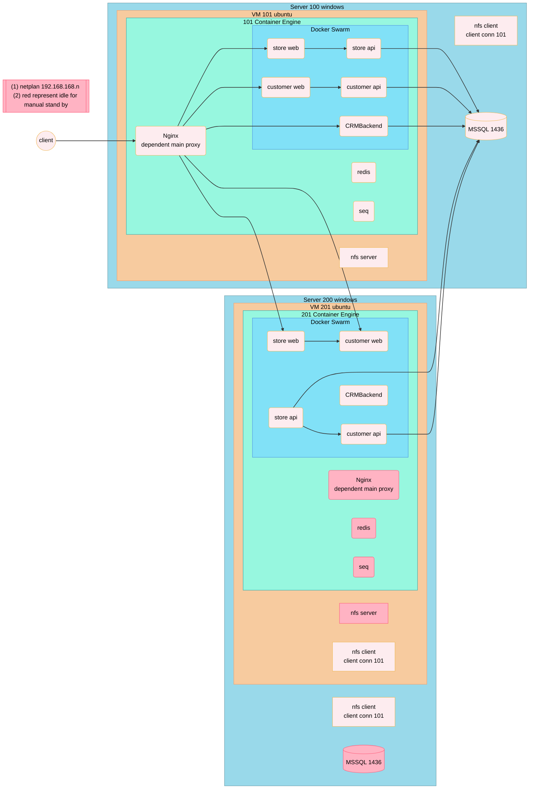
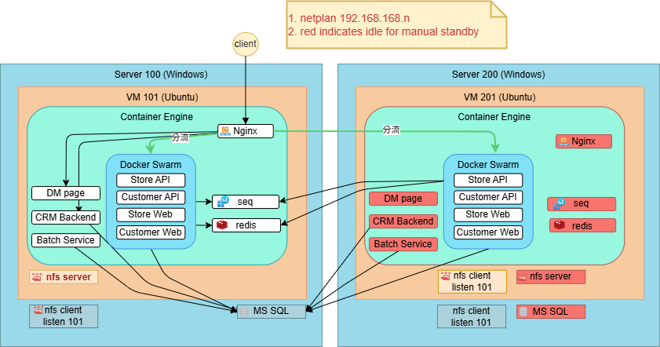

# Infra Diagram Tool

## Mermaid

- Service 關係示意
- Request flow
- CI/CD pipeline
- 小型單機或單服務結構
- ✅方便 diff 版控
- ❌不支援服務 icon 顯示
- ❌無法精準位置控制

## Drawio

- 系統架構圖
- Infrastructure Diagram
- 高可用設計
- 安全 / Network / Trust Boundary
- 跨團隊、跨角色溝通
- ✅服務 icon 支援多元
- ❌可版控但 diff 不易閱讀 (xml)
- ❌無法整合 README.md (只能匯出 png/svg)

