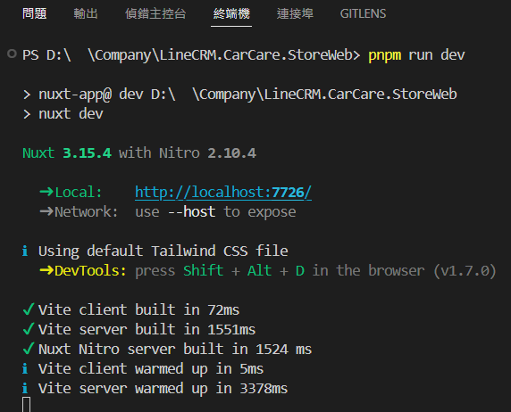
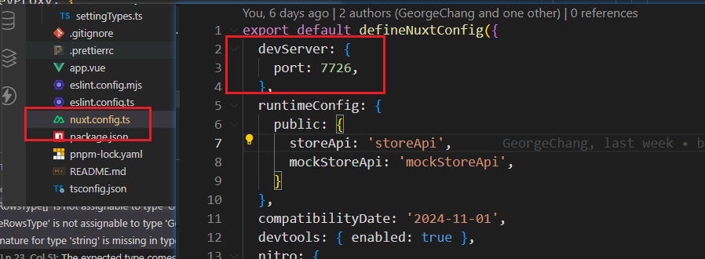
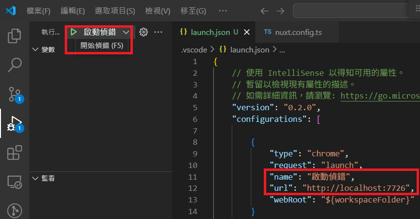
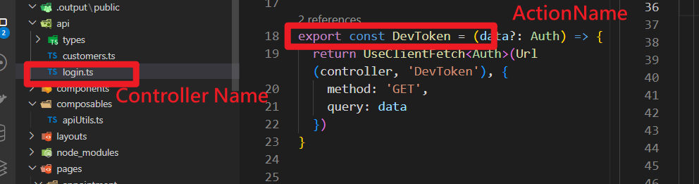

# Nuxt3

Nuxt 前端，整合 Net 後端全站開發筆記

### 專案準備

1. git clone 

2. 手動指令安裝 pnpm

3. 安裝相依套件：pnpm install

4. 建立正式編譯檔：pnpm run build

5. 啟動開發伺服器：pnpm run dev

6. pnpm啟動完畢
   

7. 專案設定的 url 是

   

8. 設定完畢後，pnpm run dev 開發伺服器完畢，可使用F5 啟動偵錯
   


1. 測試帳號準備與登入

   [^測試帳號準備]: 回共同注意事項查看

#### 檔案結構目錄

共同開發說明>開發注意事項>前端開發>檔案結構目錄

撥空了解 Nuxt 結構目錄

https://clairechang.tw/2023/07/07/nuxt3/nuxt-v3-directory-structure/

請深入閱讀必要了解項目

1. `pages/`、`layouts/`、`components/` → 頁面結構與 UI 組合
2. `composables/` → 邏輯封裝、狀態管理
3. `plugins/`、`middleware/` → 應用啟動與權限控制
4. `stores/` → 使用 Pinia 管理狀態

#### 檔案結構目錄-components

1. component/{pages Name}

   1. 作為子元件與父元件 ( pages.vue ) 溝通使用

   2. 抽離元件邏輯，避免 pages/{router}/{subRouter}.vue 理由: 行數過多不好閱讀: SOLID 的第一條，SRP ，一個模組不應處理過多事情

      頁面可以精簡僅負責整合 api 回傳與 UI 顯示、`pages/*.vue` 行數控制在 300 行以內。

      api/{controller}.vue 也同理，若 api/{controller}.vue 過長、須同步考慮是否後端 controller.cs 處理太多事情

   3. 複用相同 ui 邏輯: 理由: dont repeat youself

   4. 有依賴父元件 ( pages.vue ) function 互動邏輯時

   5. 頁面有細部排版需求

      components 就像 net partialView，具備堆疊、組合、嵌套、調整顯示順序的彈性

      當畫面結構需要大幅調整，或同一區塊需呈現多種排版以供比較時，將內容拆分為可重組的元件會遠比操作整段 <htmlTag>`更靈活高效

      這種元件化思維有助於快速實驗、比對設計方案，也大幅提升視覺邏輯的可控性與維護速度。

   6. ex: components\Menu\settingMenu.vue

2. component/Common

   1. 複用相同 ui 邏輯
   2. 不依賴外部 function 互動邏輯時，公用元件
   3. 定義泛用 props 或 interface 定義在 component/types/{componentName}.ts
   4. ex: staticTable 靜態顯示列表、model 頁面跳出視窗、LoadingSendBtn  防止重複送出按鈕

#### 檔案結構目錄-pages

Vue 專案都需要路由配置，但 Nuxt 卻沒有，是因為底層已經自動整合 Vue Router，依照資料夾以及檔案結構配置路由，所以更需要小心，在 pages 項下不可以有非路由的當案存在。

- 自動路由

pages/{router}/{subRouter}.vue ex: /customer/index.vue、 /customer/GetAll.vue

- 動態路由

pages/{router}/[dynamicRouter].vue ex: /customer/[CarNo].vue

- 避免有非路由元件存放在 pages 
  1. 自動路由污染: `pages/customer/CustomerMenu.vue`，Nuxt 就會產生一個 `/customer/customerMenu` 的路由，意味著 search engine 可能 index 到這些元件的空白頁，徒增有安全隱患 。
  2. 破壞專案結構的可預期性: 預期：`pages/` 是 route，`components/` 是元件，把 component 放在 `pages/`，會讓新進開發者搞不清楚這個檔案的用途，是 route 還是 UI 片段。

#### api 開發 溝通後端

LineCRM.CarCare\StoreWeb\api\login.ts



詳閱: 共同開發說明>開發注意事項>共同注意事項>api 開發規範，注意檔案、function 有命名規範。

##### api 連線

有三種方式

1. api 連線實體 server : localhost 

   StoreApi

   target: 'http://localhost:5128',

2. api 連線實體 server : Container

   carcare-storeapi-web-ui-dev

   target: 'http://192.168.100.41:7728',

3. api 連線 mock : postman mock

   mockStoreApi

   target: "https://64680c7d-60de-4ffe-abb7-462f3958d8df.mock.pstmn.io",

##### api 連線實體 server : localhost

`本地 api 要 run 起來`，連線 localhost 測試來進行前端開發

LineCRM.CarCare\StoreWeb\nuxt.config.ts

target: 'http://localhost:5128',

```typescript
nitro: {
    devProxy: {
      '/storeApi': {
        target: 'http://localhost:5128',
        changeOrigin: true,
        secure: false,
      },
```

##### api 連線實體 server : Container

LineCRM.CarCare\StoreWeb\nuxt.config.ts

target: 'http://192.168.100.41:7728',

```typescript
nitro: {
    devProxy: {
      '/storeApi': {
        target: 'http://192.168.100.41:7728',
        changeOrigin: true,
        secure: false,
      },
```

##### api 連線 mock : postman mock

1. 模擬資料建立

   [^postmanServer]: 點選這裡看說明

2. api 執行 url 參數多一個 ismock true

```typescript
return UseClientFetch(Url(controller, 'LineAuth'), {
    method: 'GET',
    query: data
  })
//改成
return UseClientFetch(Url(controller, 'LineAuth',true), {
    method: 'GET',
    query: data
  })
```

##### 前端開發 Api 溝通測試

登入 Postman 查看需要對接的後端 api 與查看回傳參數

#### api 開發範例

api function call 開發使用參考

共同開發說明>開發注意事項>前端開發>api 開發範例

LineCRM.CarCare.StoreWeb\api\customers.ts
命名方式 LineCRM.CarCare.StoreWeb\api[ControllerName].ts
回傳需打包 apiServiceResult
authorization 不需要傳入，只要有正常走登錄流程，authorization 在 apiInterceptor 會處理好驗證問題

##### SendRequest await 命令式同步處理/非同步處理

LineCRM.CarCare.StoreWeb\pages\customer\index.vue GetCustomersDemo1

```typescript
// api\customers.ts
export const GetAll = () => {
  const result = SendRequest<apiServiceResult<CustomerRow[]>>(
    Url(controller, 'GetAll'),
    {
      method: 'GET',
    }
  )
  return result;
}

// pages\customer\index.vue

// await 命令式同步處理
// eslint-disable-next-line @typescript-eslint/no-unused-vars
async function GetCustomersDemo1() {
  try {
    const customersResult = await GetAll();
    console.error(customersResult.Data);

  } catch (err) {
    console.error('GetAll catch error:', err);
  }
}

// await 命令式非同步處理
// eslint-disable-next-line @typescript-eslint/no-unused-vars
async function GetCustomersDemo0() {
  try {
    const [res1, res2, res3] = await Promise.all([
      GetAll(), GetAll(), GetAll(),
    ]);
    return {
      a: res1, b: res2, c: res3,
    };
  } catch (err) {
    console.error('錯誤:', err);
    throw err;
  }
}

// SendRequest Promise 鍊式同步處理
async function GetCustomersDemo2() {
  Query().then((res) => {
    if (res.Success) {
      message.success('Success');
      console.error(res.Data);
    } else {
      console.error('GetCustomers Get Fail', res);
    }
  }).catch((err) => {
    console.error('GetCustomers catch', err);
  });
}
```

### alias 版本差異點

#### **Nuxt 3 預設 alias (官方)**

```
jsonCopyEdit{
  "~": "/<rootDir>",
  "@": "/<rootDir>",
  "~/assets": "/<rootDir>/assets",
  "~/components": "/<rootDir>/components",
  "~/composables": "/<rootDir>/composables",
  "~/layouts": "/<rootDir>/layouts",
  "~/pages": "/<rootDir>/pages",
  "~/plugins": "/<rootDir>/plugins",
  "~/public": "/<rootDir>/public",
  "~/server": "/<rootDir>/server",
  "~/store": "/<rootDir>/store"
}
```

#### **Nuxt 2 預設 alias**

```
jsonCopyEdit{
  "~~": "/<rootDir>",
  "@@": "/<rootDir>",
  "~": "/<rootDir>",
  "@": "/<rootDir>",
  "assets": "/<rootDir>/assets",
  "public": "/<rootDir>/public"
}
```

npx nuxi init StoreWeb

npx nuxi init CustWeb
npx nuxi init PortalWeb

```shell
npx nuxi init ITSMobileCare
npx nuxi@latest devtools enable
pnpm install -D tailwindcss postcss autoprefixer

# 如果是用 npm 的話
npx tailwindcss init -p

# 如果是用 pnpm 的話(不能 npx 直接執行，安裝路徑都不一樣)
pnpm install -D tailwindcss-cli
pnpm exec tailwindcss-cli init -p
```

**要自訂 Nuxt 配置？** 編輯 `nuxt.config.ts`
**要加入 API？** 在 `server/` 內新增 `.ts` 文件
**要加入全局 CSS？** 編輯 `app.vue` 或 `nuxt.config.ts`
**要加入靜態資源？** 放在 `public/` 目錄內

### fetch

#### onResponseError 

$fetch().onResponseError 是攔截器使用方式

後端沒有設定好，就可能造成解析失敗，畫面整格卡住

前端 try/catch err 也沒有用、onResponseError  

#### 回應資料格式問題與傳輸機制（chunked）

```c#
return context.Response.WriteAsync("{\"error\":\"Unauthorized\"}");
```

使用 **chunked transfer encoding**，會導致前端 `$fetch`：收不到正確結尾（chunk 結束符），或無法確定資料完整性，進而跳過錯誤攔截

設定 Content-Length，以避開 chunked 傳輸

```c#
var result = new { error = "Unauthorized" };
context.Response.ContentType = "application/json";
var bytes = Encoding.UTF8.GetBytes(JsonSerializer.Serialize(result));
context.Response.ContentLength = bytes.Length;
return context.Response.Body.WriteAsync(bytes, 0, bytes.Length);
```

- `Content-Length` 明確 ，就不會是 chunked 傳輸
- `Content-Type` 明確，避免前端 parse 失敗
- 確保所有內容在一次完整回應中寫入 $fetch.onResponseError 能觸發

#### Chunked 傳輸原理（HTTP/1.1）

沒設 Content-Length，預設 chunked reponse header 會有 `Transfer-Encoding: chunked` 資料分成多段回傳（每段前加長度），沒有 `Content-Length`，必須依 chunk 結尾（0\r\n\r\n）判斷結束

**`chunked` 結尾不能手動設定**，是 HTTP 協議層自動處理的機制，不是應用層能控制的。

在 `chunked` 傳輸中，每個區塊格式為：

```
php-templateCopyEdit<chunk-size-in-hex>\r\n
<data>\r\n
```

資料結束標記為：

```
CopyEdit0\r\n
\r\n
```

這整個流程是由 **ASP.NET Core 或 Kestrel（或 IIS）在輸出流結束時自動加上去的**。

### Api 風格

`Promise.then()` → **鏈式/宣告式（chaining / declarative）**

```typescript
// Promise 鍊式同步處理
async function GetCustomersDemo2() {
  GetAll().then((res) => {
    if (res.Success) {
      message.success('Success');
      console.error(res.Data);
    } else {
      console.error('GetCustomers Get Fail', res);
    }
  }).catch((err) => {
    console.error('GetCustomers catch', err);
  });
}
```

`async/await` → **命令式/同步風格（imperative / synchronous-like）**

```typescript
// await 命令式非同步處理
async function GetCustomersDemo0() {
  try {
    const [res1, res2, res3] = await Promise.all([
      GetAll(), GetAll(), GetAll(),
    ]);
    return {
      a: res1, b: res2, c: res3,
    };
  } catch (err) {
    console.error('錯誤:', err);
    throw err;
  }
}

// await 命令式同步處理
async function GetCustomersDemo1() {
  try {
    const customersResult = await GetAll();
    console.error(customersResult.Data);

  } catch (err) {
    console.error('GetAll catch error:', err);
  }
}
```


### build Image

1. Nuxt 專案需要 build image 的 Dockerfile 是 SSR

2. 依賴 pnpm 安裝

3. run port 2677

4. 需要 nginx 代理後端 http://localhost:2677/storeApi 要導向 http://192.168.100.41:7728

   http://localhost:2677/storeApi/Login/Auth 要導向 http://192.168.100.41:7728/Login/Auth

## 建立 API

- 在 `server/` 目錄建立 API，Nuxt 會依據資料夾結構自動生成 API 路徑
- 使用 `defineEventHandler()` 建立事件處理器

範例檔案結構：

```
server/
|—— api/
  |—— hello.js
|—— routes/
  |—— hello.js
```

放置於 `/server/api` 下的檔案，依據檔案名稱產生 `/api` 前綴路徑（`/api/hello`），如果不想加上 `/api` 前綴，將檔案放置於 `/server/routes` 即可

> 不論副檔名為 `.js`、`.ts`，均依據檔案名稱產生 API 路徑

**範例：**新增 `/api/hello` API

```
// server/api/hello.js
export default defineEventHandler(() => 'Hello World!');
```

接著在瀏覽器開啟頁面

------

## **HTTP Methods**

Server API 預設請求方法為 `get`，如果要調整其他方法 `post`、`patch`、`delete`，加在檔名後綴即可

```
server/
|—— api/
  |—— user.post.js
  |—— user.delete.js
```

**範例：**新增 `/api/user` API，並使用 `post` 方法

> Nitro 搭配 [unjs/h3](https://github.com/unjs/h3) 來建立 Server API，`readBody()` 為 [unjs/h3](https://github.com/unjs/h3) 提供的 utilites，用來取得 request body，其他 utilites 可以參考 [官方文件](https://github.com/unjs/h3#utilities)

```
// server/api/user.post.js
export default defineEventHandler(async event => {
  const body = await readBody(event);
  return { ...body };
});
```

在頁面使用 Nuxt3 `useFetch` 方法發出請求（[useFetch 參考文章](https://clairechang.tw/2023/07/19/nuxt3/nuxt-v3-data-fetching/)）

```
// pages/index.vue
<template>
  <div>
    <div>name: {{ user.name }}</div>
    <div>age: {{ user.age }}</div>
  </div>
</template>

<script setup>
const { data: user } = useFetch('/api/user', {
  method: 'post',
  body: {
    name: 'Daniel',
    age: 18
  }
});
</script>
```

------

## **捕捉所有路由（Catch-all Route）**

透過檔名 `[…]` 來捕捉未被定義的 API 路徑（fallback route）

範例檔案結構：

```
server/
|—— api/
  |—— hello.js
  |—— [...].js
```

透過 `createError()` 方法來處理錯誤

```
// server/api/[...].js
export default defineEventHandler(() => {
  throw createError({
    statusCode: 404,
    statusMessage: 'API Path Not Found'
  })
});
```

當我們向未定義的路由發出請求，例如 `/api/nothing`

```
// pages/index.vue
<template>
  <div>
    error:
    <pre>{{ error.data }}</pre>
  </div>
</template>

<script setup>
const { error } = useFetch('/api/nothing');
</script>
```

# Middleware

# Nitro

